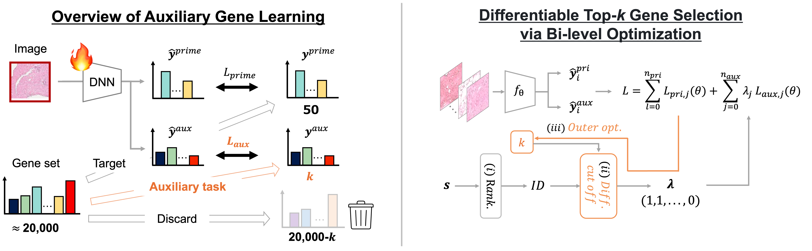

# Auxiliary Gene Learning 🧬
"Auxiliary Gene Learning: Spatial Gene Expression Estimation by Auxiliary Gene Selection", in **AAAI2026** 🎉🎉!

Shikui Kaito, Kazuya Nishimura, Shinnosuke Matsuo, Yasuhiro Kojima, Ryoma Bise




## 📑 Abstract
*Spatial transcriptomics (ST) is a novel technology that enables the observation of gene expression at the resolution of individual spots within pathological tissues. ST quantifies the expression of tens of thousands of genes in a tissue section; however, heavy observational noise is often introduced during measurement. In prior studies, to ensure meaningful assessment, both training and evaluation have been restricted to only a small subset of highly variable genes, and genes outside this subset have also been excluded from the training process. However, since there are likely co-expression relationships between genes, low-expression genes may still contribute to the estimation of the evaluation target. In this paper, we propose $Auxiliary \ Gene \ Learning$ (AGL)$ that utilizes the benefit of the ignored genes by reformulating their expression estimation as auxiliary tasks and training them jointly with the primary tasks. To effectively leverage auxiliary genes, we must select a subset of auxiliary genes that positively influence the prediction of the target genes. However, this is a challenging optimization problem due to the vast number of possible combinations. To overcome this challenge, we propose Prior-Knowledge-Based Differentiable Top-$k Gene Selection via Bi-level Optimization (DkGSB), a method that ranks genes by leveraging prior knowledge and relaxes the combinatorial selection problem into a differentiable top-$k$ selection problem. The experiments confirm the effectiveness of incorporating auxiliary genes and show that the proposed method outperforms conventional auxiliary task learning approaches.
*

## ⬇️ Installation
To set up their environment, please run:  
(we recommend to use [Anaconda](https://www.anaconda.com/) for installation.)
```
conda env create -n hest -f hest.yml
conda activate hest
```

## 🌐 Data Preparation
You can download and preprocess the required datasets from Hest-1K using the following commands.
```
python ./script/preprocess/load_hest1k.py
python ./script/preprocess/preprocess_hest1k.py
```

Split the data into 5-fold cross-validation.
```
python ./script/preprocess/split_to_5-fold_cv.py
```

## 🚀 Training the DkGSB
You can train our proposed **Prior-Knowledge-Based Differentiable Top-$k$ Gene Selection via Bi-level Optimization** (DkGSB) using the following command.
```
python ./script/main.py --module "AGL+DkGSB" --dataset 'TENX152'
```

## 🔥 Training the comparative methods
If you would like to run the comparative experiments, please execute the following commands:

1. **AGL** — Training with **all auxiliary genes**
```
python ./script/main.py --module "AGL" --dataset 'TENX152'
```
2. **Primary-only** — Training with **only the primary genes**
```
python ./script/main.py --module "PGL" --dataset 'TENX152'
```

## 📊 Evaluation of Each Method
You can evaluate the following three approaches:

1. **DkGSB (Prior-Knowledge-Based Differentiable Top-$k$ Gene Selection via Bi-level Optimization)**  
```
python ./script/main.py --module "AGL+DkGSB" --dataset 'TENX152' --is_evaluation 1
```

   
2. **AGL (All Auxiliary Genes)**  
```
python ./script/main.py --module "AGL" --dataset 'TENX152' --is_evaluation 1
```

3. **Primary-only**  
```
python ./script/main.py --module "PGL" --dataset 'TENX152' --is_evaluation 1
```


## 🔍 Citation
If you find this repository helpful, please consider citing:
```
Comming soon !
```

# ✏️ Author
@ Kaito Shiku
・ Contact: kaito.shiku@human.ait.kyushu-u.ac.jp
